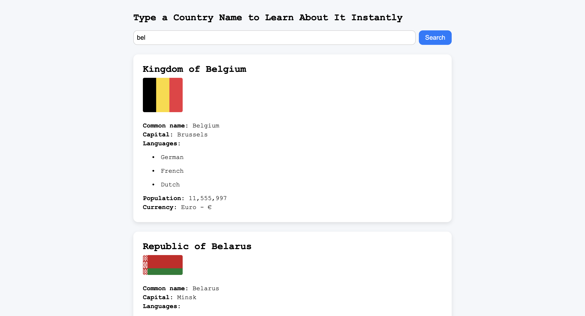

# 🌍 Country Search App

A simple web application that allows users to search for any country by name and view key information like its flag, capital, population, currency, and languages.

## 🚀 Features

- 🔍 Search for a country by name
- 🏳️ View the national flag
- 🏛️ See the capital city
- 🗣️ Explore official languages
- 👥 Check the population
- 💰 Get the currency and symbol

## 📸 Screenshots

 

## 🛠️ Technologies Used

- HTML
- CSS
- JavaScript
- [REST Countries API](https://restcountries.com/) for live country data